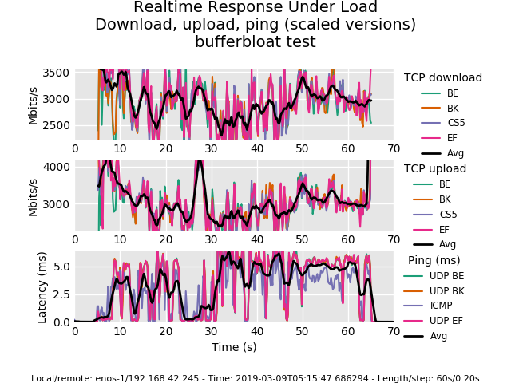
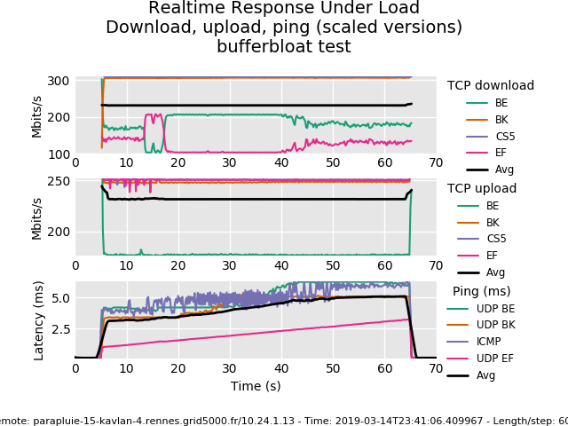

EnOSlib primer
==============

Let's consider a user called Alice or Bob.

{{ user }} would like to start a network benchmark between the nodes of an
infrastructure. {{ user }} chooses to go with `flent <https://flent.org/>`_ and
thus writes the following:

.. literalinclude:: tutorials/ansible-integration/flent_on.py
   :language: python
   :linenos:

This starts {{ user }}'s experiment on the local machine using Vagrant (with
libvirt). Note that a {{ user }}'s friend will be able to run the same using
``backend="virtualbox"`` if VirtualBox is installed. Now
looking at the result directory created at the end of the execution, {{ user }}
finds:

{{ user }} launches several times the script, getting new results. Subsequent
runs are faster because the machines are already up and everything is
`idempotent <https://en.wikipedia.org/wiki/Idempotence>`_.

{{ user }} now would like to go in a `real` testbed (e.g Grid'5000). Good news ! {{ user }}
only have to adapt the configuration phase and the provider used in the script.
The experimentation logic can remain the same. Thus, one can write the following:

.. literalinclude:: tutorials/ansible-integration/flent_on_grid5000.py
   :language: python
   :linenos:

Now where {{ user }} can go from here depends on the needs:

- Moving to another provider is possible. {{ user }} only needs to learn about the specific object for
  this configuration -- e.g see :ref:`[1a] <vmong5k>`, :ref:`[1b] <distem>`.

- Refactoring the code, providing a command line interface could be also nice.
  After all its just python code -- see :ref:`[2] <tasks>`.
  Or moving the deployment code (because it becomes large) into separated
  Ansible files -- see :ref:`[3] <integration-with-ansible>`.

- Applying specific network constraints between the nodes of the reservation is
  also possible. {{ user }}'ll need to learn more about how enforcing the constraints
  -- see :ref:`[4] <netem>`.

- Deploying a monitoring stack can be convenient to track some system metrics. |enoslib| offers
  some services that can be used easily -- see :ref:`[5] <monitoring>` or :ref:`[6] <skydive>`.

- Contributing to this project would be wonderful. {{ user }} doesn't need to do much,
  improving the documentation would be very helpful -- see :ref:`[5] <contributing>`.

