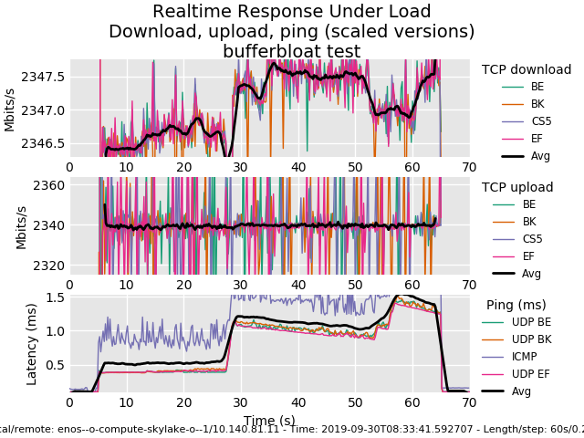

*********************************
Chameleon/ChameleonEdge tutorials
*********************************

.. contents::
   :depth: 2

This tutorial will let you get started using |enoslib| and
Chameleon/ChameleonEdge.  Chameleon provider is a specialization of the
OpenStack provider (so this should be theoretically possible to work with a custom
OpenStack platform, but we didn't push too much effort on this lately :))

Here we present you the bare minimum to install the library with the required
dependencies.

.. hint::

   For a complete schema reference see :ref:`openstack-schema`

Installation
============

.. code-block:: bash

    # This will install the openstack clients
    $ pip install enoslib[chameleon]

.. note::

  It's a good practice to use a virtualenv or a python version manager like `pyenv`.

Chameleon Bare-metal Example
============================

The following reserve 2 nodes on the chameleon bare-metal infrastructure.  The
preferred way of authenticating to the Chameleon provider using EnOSlib is
through application credentials (EnOSlib will transparently source your
application credentials when needed)

.. literalinclude:: chameleon/tuto_chameleonbaremetal.py
   :language: python
   :linenos:

.. note::

   Similarly to other provider the configuration can be generated
   programmatically instead of using a dict.

The result of the above code is the following:

Chameleon / ChameleonEdge Example
=================================

To mimic an FOG deployment you can claim resources on the Chameleon
Infrastructure (acting as the Cloud) and the ChameleonEdge Infrastructure
(acting as the Edge). The following example lets you deploy a simple Machine
Learning pipeline: images are collected at the Edge and sent to the cloud for
inference. We show the main script, other resources can be found in |enoslib|
source code.

.. literalinclude:: multi_providers/tuto_chameleon_edge_to_cloud.py
   :language: python
   :linenos:
