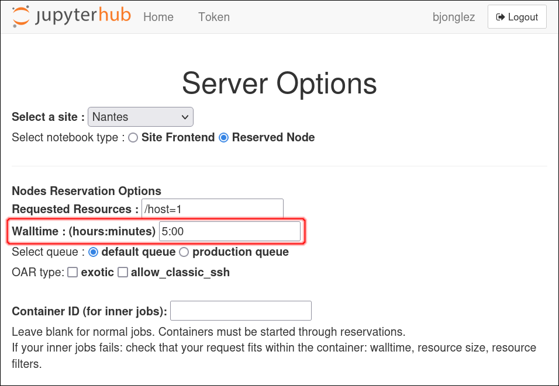

.. _performance_tuning:

******************
Performance tuning
******************

This page is about tricks to speed up the deployment time for large
experiments (i.e. experiments involving many nodes).

Increase Ansible parallelism
============================

.. note::

  This is only supported since Enoslib 9.0.0.  Previous versions had a
  fixed parallelism level of 100.

By default, Enoslib only configures 5 nodes at a time using parallel
connections.  This should be increased to speed up large experiments, but
beware of a few side-effects :

- your control node must have sufficient CPU and memory capacity to handle
  a large number of forks.  On Grid'5000, this usually means using a
  dedicated Grid'5000 node (physical server) as the control node for Enoslib.

- when using a SSH jump gateway (e.g. when running outside of Grid'5000),
  there is a limit to the number of parallel connections you can open
  simultaneously on the SSH gateway, usually around 10-15.

See :ref:`global_config` for more details on configuration settings.

.. literalinclude:: performance_tuning/vmong5k_forks.py
   :language: python
   :linenos:

Using a dedicated control node on Grid'5000
===========================================

While small experiments can be started from the Grid'5000 frontends
systems, keep in mind that they are shared systems, which means that you
could quickly saturate their CPU and memory: this will not only slow down
your experiment, but also slow down other users of the platform.  Thus,
using a dedicated control node is a good practice for large Grid'5000
experiments.

Dedicated control node with a Jupyter notebook
----------------------------------------------

Using the `Grid'5000 Notebook interface
<https://intranet.grid5000.fr/notebooks/>`_, you can start a Jupyter
notebook that runs on a Grid'5000 node.  You can then run the control part
of your experiment in this notebook.

Make sure to select a walltime that is long enough, while complying with
the `Usage Policy
<https://www.grid5000.fr/w/Grid5000:UsagePolicy#Rules_for_the_default_queue>`_.
After this walltime is over, your Jupyter notebook will automatically be
closed.  If you need additional time, it is possible to `extend the
walltime of an existing job
<https://www.grid5000.fr/w/Advanced_OAR#Changing_the_walltime_of_a_running_job_.28oarwalltime.29>`_,
but you should still comply with the Usage Policy.

Dedicated control node with a OAR job
-------------------------------------

Using OAR, it is possible to reserve a single control node on which your
experiment script will be run automatically.  Your experiment script will
then reserve additional nodes using Enoslib.

Connect to a Grid'5000 frontend using SSH.  It can be any frontend, but
you will obtain better deployment performance if the frontend is
geographically close to your nodes (on the same site or a nearby site).

Start by preparing a virtualenv with your desired version of Enoslib:

.. code-block:: shell

    nantes$ python3 -m venv enoslib-venv
    nantes$ source enoslib-venv/bin/activate
    (venv)$ pip install -U pip
    (venv)$ pip install -U 'enoslib>=8,<9'

Then, to submit a job with your experiment, use ``oarsub`` on the same frontend:

.. code-block:: shell

    $ oarsub -l walltime=0:45 "./enoslib-venv/bin/python my_short_experiment.py"
    OAR_JOB_ID=42424242

``oarsub`` returns the job ID immediately, but your job will be started
asynchronously. Once it is running, you can monitor the console output of
your experiment using the job ID:

.. code-block:: shell

    $ tail -F OAR.42424242.stdout

To submit a job while making sure that your experiment runs during the
night (see Usage Policy), with a walltime of up to 14 hours:

.. code-block:: shell

    $ oarsub -t night -l walltime=13:55 "./enoslib-venv/bin/python my_experiment.py"

If you want to start your experiment at a specific date and time, for
instance during a week-end:

.. code-block:: shell

    $ oarsub -r "2023-08-05 19:00" -l walltime=61:55 "./enoslib-venv/bin/python my_experiment.py"

If you really care about your deployment time, you can ask for a control node with
a minimum number of CPU cores and amount of RAM, using `OAR properties <https://www.grid5000.fr/w/Advanced_OAR#Selecting_resources_using_properties>`_:

.. code-block:: shell

    $ oarsub -p "core_count >= 20 AND memnode >= 64000" -l walltime=2:30 "./enoslib-venv/bin/python my_experiment.py"

Running large Grid'5000 experiment from your laptop
===================================================

In some case, you might really need to run an experiment from your laptop
or from a machine that is outside of the Grid'5000 network.  In this case,
we suggest to:

- setup the `Grid'5000 VPN <https://www.grid5000.fr/w/VPN>`_

- disable the automatic SSH jump host feature (see :ref:`global_config`)

- increase the number of forks (see :ref:`global_config`)

- enable Ansible pipelining (see below)

Ansible pipelining
==================

`Ansible pipelining
<https://docs.ansible.com/ansible/latest/reference_appendices/config.html#ansible-pipelining>`_
can speed up performance by 2x when performing several short actions in a
row.  However, it may possibly be incompatible with ``become``, ``run_as``
and ``sudo``, so you need to check if it applies to your case.

To activate it, simply define the environment variable at the start of
your experiment code:

.. code-block:: python

    import os
    import enoslib as en

    os.environ["ANSIBLE_PIPELINING"] = "True"

Designing your experiment for batch actions
===========================================

If you have many small actions to run on your nodes, prefer using a
:py:class:`~enoslib.api.actions` block instead of individual
:py:func:`~enoslib.api.run_command` calls.

See :ref:`integration-with-ansible` for more details.

Various Ansible tips and tricks
===============================

- Use fact caching: https://docs.ansible.com/ansible/latest/plugins/cache.html
- Tune the default execution strategy: https://docs.ansible.com/ansible/latest/playbook_guide/playbooks_strategies.html
- Switch to a more efficient execution backend with mitogen: https://mitogen.networkgenomics.com/

Other performance improvement ideas
===================================

- Build a preconfigured image (application specific)
